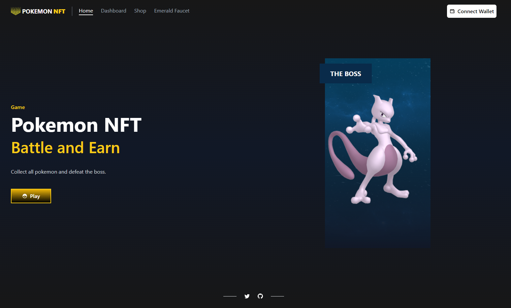

<h1 align="center">Welcome to PokemonNFTGame 👋</h1>
<p>
  
</p>

> Buildspace Project - Create your own mini turn-based NFT browser game



### ✨ [Demo](https://buildspace-nft-game-orpin.vercel.app/)

## Install

```sh
npm install
```

## Usage

```sh
npm run dev
```

## Blockchain
Use [Emerald Paratime Testnet](https://docs.oasis.dev/general/developer-resources/emerald-paratime/) how network of project

Web for add anything network -> https://chainlist.org/

Emerald Faucet: https://faucet.testnet.oasis.dev/


## Author

👤 **Aarush Agarwal**

* Github: [@Blueuwu](https://github.com/blueuwu)
* LinkedIn: [@Aarush Agarwal](https://linkedin.com/in/aarush-ag/)

## Show your support

Give a ⭐️ if this project helped you!

***
_This README was generated with ❤️ by [readme-md-generator](https://github.com/kefranabg/readme-md-generator)_
